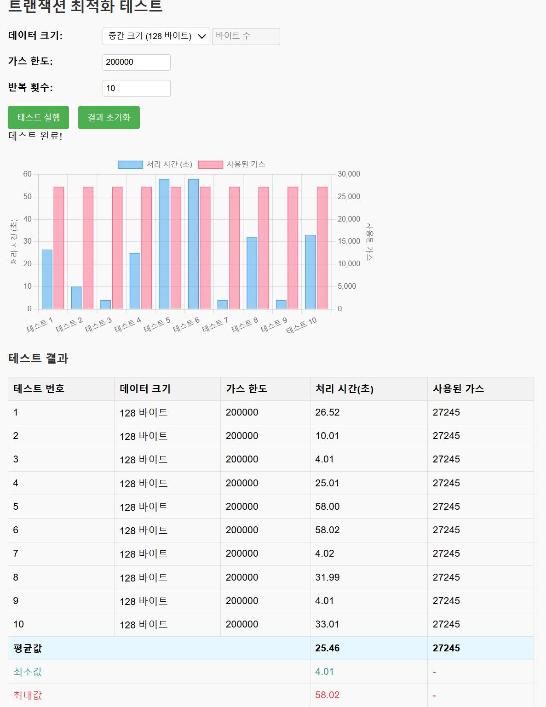

# 김성훈

## 1주차

### 3 / 4
피그마 컴포넌트 기능 중 불리언 설정법 복습
C4D 기본 인터페이스 학습

### 3 / 5
블록체인 기본 개념 학습

### 3 / 6
블록체인 트랜잭션, 스마트 계약, 공개키, 개인키 암호화 방식에 대해 학습

### 3 / 7
리액트, 리액트 네이티브, 플러터 프레임워크 간 차이와 passkey, 지문인식 적용 가능성에 대해 학습

## 2주차

### 3 / 10
블록체인 DID 및 지갑 개념에 대한 이해 및 블록체인 분야의 미래에 대해 학습

### 3 / 11
블록체인 아키텍처 구성, 구글 클라우드 블록체인에서 RAFT 합의를 사용할 때의 최소 호스팅 노드 숫자
- 검증자 노드, RPC 노드, 모니터링 노드로 최소 3가지가 필요함.
- 프론트엔드는 보통 RPC 노드와 소통하는 인터페이스로 작용하며 프론트엔드는 블록체인 네트워크에 직접 들어와 있는 노드로 취급되지 않음
- 백엔드는 노드와 WAS를 구성하며, WAS에서 스마트 계약 작성 모듈과 배포 모듈을 탑재
- 프론트엔드에서의 요청에 맞춰 WAS에서 스마트 계약작성 하는 방식은 '중앙화에 가까움'
- 프론트엔드 부담이 적어지고 캐시를 이용하여 안정적인 서비스가 가능하다는 장점이 있으나 중앙화를 하면 블록체인 사용의 의의가 퇴색됨
- 그렇다면 프론트엔드에서 직접 사용자의 요청에 따라서 직접 호출할 수 있음. 프론트엔드에서 Web3.js를 이용해서 RPC노드로 배포하여 블록체인 네트워크에 스마트계약을 배포함.
- 직접 호출은 탈중앙화라는 의의를 달성할 수 있으나 프론트엔드의 서비스 안정성이 떨어지고, 디바이스 자원을 사용해야하고, 프론트엔드 개발에 단순히 api요청으로 끝나지 않고 스마트 계약 작성모듈과 배포모듈(서비스)를 구현해야한다는 단점이 있음.
- 대부분의 Dapp은 이 때문에 두 방식을 적절히 섞은 하이브리드 방식을 사용하며,
- 완전한 탈중앙화는 서비스의 '목적'을 달성하기 위한 '수단'이기에 탈중앙화가 우리의 목적에 적합한지 안한지 고민해야함.

-> 우리 서비스에서는 먼저 rest요청으로 인증/인가를 WAS를 먼저 거치고 인가 후에는 프론트엔드와 WAS 둘 다 스마트 계약 작성모듈과 배포 모듈을 구현하기로함.

### 3 / 12
블록체인 DID 생성 방법 및 DID 복구 방법 학습
- DID는 개인키를 유추가 불가능한 단방향 함수를 이용하여 공개키로 만들고 그것을 해시화 혹은 그대로 식별자로 사용함.
- 블록체인 네트워크에 did:0x.... 순으로 did가 등록되면 공개키를 이용해서 did를 찾을 수 있음.
- 이 did가 연결된 did 문서를 did를 이용해서 불러올 수 있게 됨.
- 만약 개인키를 소유하고 있는데 did를 분실한 경우, 개인키로부터 공개키를 도출하고, 그것으로 다시 did 식별자를 찾아 did를 가져올 수 있음.
- 따라서 현재 PIN으로 개인키를 암호화하여 서버에 저장하기로 한 우리 서비스에서는 개인키를 분실할 일이 없으니
- DID 관리에 집중할 필요가 다소 줄어듦.
- 그러나 개인키 암호문 서버저장이라는 문제는 피해가기 어려운 것은 사실임
- MVP에 집중한다는 면에서 해당 문제는 후순위로 미뤄도 좋을 것이라 생각함.

### 3 / 13
블록체인 노드 생성 및 트랜잭션 테스트
- docker를 이용해 블록체인 네트워크를 구성하고 네트워크 내에 트랜잭션을 다른 노드에서 볼 수 있는지 확인
- docker에 이미 올라와있는 ethreum image를 이용해 컨테이너를 올려 프라이빗 네트워크를 구성함.
- docker compose geth init을 이용해 제네시스 노드를 초기화함.
- docker compose.yml에 1.bootstrap, 2.ethe1, 3.ethe2, 4. ethe3 4개의 이미지를 빌드, 컨테이너로 실행함.
- 각 컨테이너를 프라이빗 네트워크로 묶어서 연결함.
- docker exec -it [컨테이너명] geth attach 로 콘솔을 불러오고 콘솔 내에 계정을 생성하여 block를 생성함.
- 트랜잭션이 블록에 기록되려면 시간이 걸림. 블록하나에 여러개의 트랜잭션이 들어갈 수도 있음.
- miner 모듈을 설정하면 block을 만들고 트랜젝션을 생성할 수 있음. 이 트랜잭션이 블록으로 기록
- 블록 생성이 완료되면 트랜잭션에 블록 넘버가 붙음.
- 타 노드에서는 이 블록을 주소를 통해 접근할 수 있음.
- 현재 타 노드에서 트랜젝션을 확인하는 것을 테스트 해보지 못했으며, net.peerCount, net.listening 등의 명령으로 노드 연결과 마이닝을 확인함.
- 원래 기록을 하기위해서는 remix ide 등을 이용해 정보를 바이트 코드로 바꿔야한다고함.
- geth는 web3.js를 지원함으로 아마도 계정정보를 이용해 확인을 할 수 있을 것으로 추정.
- 1. 네트워크 내의 타 노드에서도 블록을 조회할 수 있는가, 2. 오프체인에서 인터페이스를 통해 네트워크에 접근하여 정보를 받거나 쓸 수 있는가.
- 3. 2가 가능하다면 기록과 조회에 얼마나 많은 시간이 걸리는가, 4. did가 다를 때 권한 이양은 어떻게 진행하는가
- 1~4의 테스트를 진행하여 기록하고 최적의 방식을 고안해야함.

### 3 / 14
프라이빗 이더리움 네트워크 구축 및 트랜잭션 테스트
- 프라이빗 블록체인 네트워크는 여러 방법이 있지만 1. 이더리움 네트워크, 2. 하이퍼레저 패브릭을 쓸 수 있을 것.
- 하이퍼레저 패브릭은 의료정보 저장을 위한 특허나 논문이 이미 2021년 정도에 존재했으며 높은 보안성을 갖춰서 의료정보에 쓰려는 노력이 있었던듯.
- 코로나 시기와 겹쳐서 정보의 신뢰도를 높이는데 블록체인은 도움이 되지만
- 하이퍼레저는 p2p 방식이 아닌 백엔드 서버를 거치는 만큼 탈중앙화라는 특성을 살리기는 어렵다고 생각됨.
- 하이퍼레저는 여러 채널과 노드, 계층을 두어 보안성은 높아지나 아키텍처 구성이 다소 복잡.

Web3.js와 Fabric SDK 비교
| 기능 | Web3.js (이더리움) | Fabric SDK (하이퍼레저) |
|-----|-------------------|----------------------|
| 연결 방식 | web3 = new Web3('http://localhost:8545') | gateway.connect(ccp, { wallet, identity: user, discovery }) |
| 컨트랙트 호출 | contract.methods.set(value).send({from: account}) | contract.submitTransaction('SetValue', value) |
| 데이터 조회 | contract.methods.get().call() | contract.evaluateTransaction('GetValue') |
| 이벤트 리스닝 | contract.events.ValueSet() | contract.addContractListener(event => {...}) |
| 계정 관리 | 개인키/공개키 | X.509 인증서 |

- 이더리움 네트워크는 레퍼런스가 많아서 구축은 쉬운 편.
- 일단 이더리움 네트워크로 구현하고 테스트를 진행함. 목요일의 테스트 항목을 3번까지 진행함.

1. 네트워크 내의 타 노드에서도 블록을 조회할 수 있는가.

        결과 : 조회할 수 있다.

        1) 부트스트랩 노드에서 계정생성 -> 이더베이스 설정 -> 이더리움 채굴시작 -> 스마트컨트랙트(바이트코드) 생성 -> abi 생성 -> 바이트 코드+abi로 컨트랙트 생성 -> 영수증에 적힌 컨트랙트 주소 확인 -> 인스턴스 생성을 진행함.

        2) 타 ethe1 노드에서 계정생성 -> 이더베이스 설정 -> abi 설정 -> 컨트랙트주소+abi로 인스턴스 생성까지 마무리
            
        3) 부트스트랩 노드에서 ethe1 노드의 계정 주소를 입력하여 가스비를 포함한 이더리움 이전 트랜잭션 전송
            
        4) 채굴을 통해 트랜잭션 처리

        5) ethe1 노드에서 이더리움 잔고 확인 -> 수신한 이더리움으로 인스턴스를 이용해 '정보'를 기록하는 트랜잭션 전송 시도

        6) 부트스트랩에서 받은 트랜잭션 요청을 처리함
        
        7) ethe1 노드에서 인스턴스 조회 함수를 호출하여 기록된 '정보'를 확인

2. 오프체인에서 인터페이스를 통해 네트워크에 접근하여 정보를 받거나 쓸 수 있는가.

        결과 : 가능하다.

        1) index.html을 생성하여 로컬호스트를 통해 bootstrap노드에 직접접근

        2) 노드 내부의 계정을 이용해 트랜잭션을 전송하고 처리함.

        3) 노드 내부의 계정을 이용해 트랜잭션을 조회함.

        4) web3.js를 통해 쉽게 구현할 수 있음.

        5) 다만 이 방식은 노드 내부에 계정을 직접 생성하고 그 계정을 조작하는 방식으로 기능함.

        6) 실제로는 metamask등의 디지털지갑에서 서명을 진행하는 식이므로 이렇게 조작할 수 없음.
        
        7) 로컬 방식이라는 점, did를 사용하지 않는다는 점에서 테스트를 확장할 필요가 있음.

3. 2가 가능하다면 기록과 조회에 얼마나 많은 시간이 걸리는가

        결과 : uint256 자료값에서 같은 값임에도 시간이 들쑥날쑥하게 진행됨.

        1) 128바이트의 값에서 10~60초 사이로 트랜잭션 기록 시간이 크게 다름.
        2) 가스비용같은 경우는 자료형이 같으므로 비용은 27245로 고정되었는데도 시간이 다른것은 이상
        3) 도커 컴포즈 설정에서 블록 생성 시간을 15초로 잡아두어서 일단 느림
        4) 조회는 거의 즉각임. 트랜잭션 처리를 거치지 않는듯.

## 테스트 결과

| 테스트 번호 | 데이터 크기 | 가스 한도 | 처리 시간(초) | 사용된 가스 |
|------------|------------|-----------|--------------|------------|
| 1          | 128 바이트 | 200000    | 26.52        | 27245      |
| 2          | 128 바이트 | 200000    | 10.01        | 27245      |
| 3          | 128 바이트 | 200000    | 4.01         | 27245      |
| 4          | 128 바이트 | 200000    | 25.01        | 27245      |
| 5          | 128 바이트 | 200000    | 58.00        | 27245      |
| 6          | 128 바이트 | 200000    | 58.02        | 27245      |
| 7          | 128 바이트 | 200000    | 4.02         | 27245      |
| 8          | 128 바이트 | 200000    | 31.99        | 27245      |
| 9          | 128 바이트 | 200000    | 4.01         | 27245      |
| 10         | 128 바이트 | 200000    | 33.01        | 27245      |
| 평균값      | -          | -         | 25.46        | 27245      |
| 최소값      | -          | -         | 4.01         | -          |
| 최대값      | -          | -         | 58.02        | -          |

  

- 4. did가 다를 때 권한 이양은 어떻게 진행하는가. 는 아직 테스트를 진행하지 않음. 다음주 진행 예정.
- geth 콘솔은 자바스크립트 기반이긴하지만 동작방식이 상당히 요상함.
- 첫 번째 실행: console.log(receipt) → null (채굴 전) / 채굴 시작: miner.start(1) → null (정상) / 두 번째 실행: console.log(receipt) → [object Object] (채굴 후: 성공!)
- null이 나오는게 정상이고, undefined나오는게 정상이고.. 오류난것 같은데 정상이라고 해서 상당히 당황스러웠음.
- 채굴을 80블럭까지 진행했는데 계정에 이더리움잔고가 안늘어나길래 봤더니 이더베이스가 기본적으로는 0x00000........01 계정(기본계정)에 설정되어있어서 잔고가 안늘어났다고 함. 이더리움을 계정끼리 분배하는 자동화 스마트컨트랙트를 처리해두면 해결가능하다고함.
- 아마 이 자동화 스마트컨트랙트가 서비스의 핵심이 될듯.
- 다음주는 프론트에서 추가할 디자인 요소를 넣고나서 metamask, did를 이용한 정보 조회, did를 이용한 권한 양도 등을 확인하면 될 듯 함. 

## 3주차

### 3 / 17
코드가 너무 길어지면 검토 자체가 힘들다. 귀찮다고 하나의 파일안에 기능을 전부 몰아넣으면 2000줄이 넘어가고 검토도 생성도 어려워진다.
이럴 때는 다 지우고 기능별로 파일을 세세하게 나누어 하는 것이 현명하다.

### 3 / 18
도커 컴포즈를 이용해서 블록체인 네트워크를 생성하고, bootstrap 노드와 통신한다. 
도커 이미지는 ethereum/client-go:v1.10.23를 사용하는데 버전이 더 높아지면 기본 합의 방식이 변해서 노드를 여러 개 켜서 합의를 맞춰줄 필요가 있고, 
http.api 명령어(웹에서 노드 조작하는 것)를 사용하는 것이 기본적으로 차단되어 개발테스트용에 적합하지 않다.
1.14정도로 최신 이미지를 사용하면, 채굴이 자동으로 진행되고 miner api가 크게 변하고 personal api가 폐기되어 이더리움 저장 베이스를 지정하는 법(일단 나는 못찾음)을 다시 배우는 등 등 새롭게 배워야한다. 그렇기에 저 버전이 그나마 낫다.

노드를 초기화하고 싶다면 ethdata/geth/*를 삭제하고, ethdash/*를 삭제하면 bootstrap 노드가 초기화된다.
keystore/는 개발의 연속성을 위해 도커 볼륨을 마운트해둔 폴더로, bootstrap 노드 안에서 personal.newAccount("비밀번호")로 계정을 생성하면 생기는 키파일이다.
이 파일이 유지가 안되면 기껏 생성한 계정이 사라져버리고, 노드에서 채굴을 할 계정을 새로 만들어야한다. 이더리움을 처음부터 다시 벌어야하는 건 덤이다.
도커 compose에 옵션을 보면 ethbase가 특정 계정명으로 되어있는 것을 볼 수 있는데 노드에서 생성하고 컴포즈를 바꾸는 식으로 진행해 이더베이스를 다시 설정해야하는 번거로움을 줄였다. 이것말고도 다른 방법은 genesis.json에서 계정 잔고를 늘려주면 된다. 잔고 많아도 채굴은 해야 트랜잭션을 할 수 있다.

이 키스토어 파일을 가지고 개인키를 추출할 수 있다. 물론 개인키를 먼저 가지고 계정을 등록하면 되는 것이 아닌가.. 하는 것도 있긴 한데 아직 못찾았다.
keystore_extract에서 keythereum이라는 패키지를 이용해 계정 생성 시 비밀번호를 입력하여 개인키를 파일로 뽑을 수 있다.

이 개인키는 각 계정을 언락하고, 각 계정에 맞는 트랜잭션을 서명하는데 쓸 수 있기 때문에 있어야 한다. web3를 쓰면 개인키 없이 비밀번호만으로 계정을 언락하여 서명없이 트랜잭션을 진행할 수 있으나, 버전 문제로 인해 insecure 옵션을 썼는데도 동작을 안하길래 걍 개인키를 썼다. 어차피 실제로 쓰기로 했던 것이니.

여튼 이제 두개의 계정, 두개의 개인키(공개키는 개인키로부터 만들면 되니 생략)가 노드에 생성되었다. 

각 계정은 순서대로 첫번째가 보호자 계정, 두번째가 병원 계정이다. 

사이트가 운용되기 전 
did레지스트리를 트랜잭션하여 등록하고 나서 did 생성 트랜잭션이 가능하다. 이 부분은 아직 공부가 덜 됐다.
did 레지스트리 주소와 공유 주소를 저장하고나서, 각 앱과 웹은 각각의 계정에 각각의 개인키로 노드와 연결을 계정을 언락한다.

앱은 반려동물의 기본정보를 담아서 did를 생성하고, 

웹은 병원의 인식 정보를 기반으로 did, 주소, 공개키를 생성한다. 웹은 생성된 정보중 did, 공개키를 qr에 담는다.
앱에서는 qr을 스캔하고 공유 계약을 생성하여 컨트랙트를 처리하고,
그 다음 앱에서는 반려동물 정보를 did와 공개키를 담아 qr로 생성하고 이를 병원에서 스캔한다. <- 이 부분이 WAS 서버로 정보를 보내 WAS에서 대신하는 부분이 된다.

병원에서는 반려동물 did와 공개키를 통해 진료 기록을 조회하고, 반려동물 did에 속성으로 진료 기록을 추가한다.
그리고 트랜잭션을 생성, 처리한 뒤, 
앱에서는 처리된 트랜잭션으로 기록된 정보를 조회한다.

### 3 / 19
협업에 있어서 공유를 자주하는 것은 타인이 잘못된 작업을 안하는데 큰 역할을 하므로 까먹지 않는 게 좋다. 사소한 거라도 하는 것이 좋다.
반성합시다.

### 3 / 20
블록체인 네트워크 구성에는 web3.js와 ethers.js 라이브러리가 주로 사용된다. 
web3.js는 레퍼런스가 많다는 장점, ethers.js는 니모닉 등 편의기능이 많다는 장점이 있다.