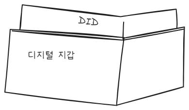

# 최은창

# 25, 03, 05

### 디지털 지갑
디지털 지갑은 암호화폐, 디지털 신원 정보, 인증서 등을 저장하고 관리하는 소프트웨어 또는 하드웨어를 의미한다.

**주요 특징**
* 암호화폐(예: 비트코인, 이더리움 등) 저장 및 거래 가능
* 개인 키(Private Key)를 안전하게 저장하여 신원 증명 및 서명 기능 수행
* DID 같은 디지털 신원 정보(Digital Credentials)도 저장할 수 있음
* 스마트폰 앱(MetaMask, Trust Wallet)또는 하드웨어(Ledger, Trezor) 형태로 제공됨

**디지털 지갑의 역할**
* 암호화폐 거래 및 관리
* DID 및 증명서(VC, Verifiable Credential)저장 및 제어
* 블록체인 기반 로그인 및 인증(비밀번호 없이 로그인 가능)

### DID (Decentralized Identifier, 분산 신원)
DID는 탈중앙화된 디지털 신원을 위한 고유한 식별자로, 중앙기관 없이 개인이 직접 신원 정보를 관리할 수 있도록 설계됨.

**주요 특징**
* 블록체인 기반의 고유한 식별자(예 did:example:1218671)
* 정부나 기업이 아닌 사용자가 직접 신원 정보 관리 가능
* 신뢰할 수 있는 기관이 제공하는 증명서(VC)를 이용하여 신원 증명 가능
* 디지털 지갑에서 DID를 저장하고 활용할 수 있음

** DID의 역할
* 신원 증명 (예: 디지털 운전 면허증, 졸업 증명서)
* 자기주권 신원(Self-Sovereign Identity, SSI) 지원 -> 사용자가 자신의 신원을 직접 관리
* 비밀번호 없는 로그인(예: 블록체인 기반 서비스에서 DID 로그인)

**정리하자면..**

|**비교 항목**|**디지털 지갑**|**DID(분산신원)**|
|---|---|---|
|개념|디지털 자산(암호화폐, 인증서 등) 저장 및 관리 도구|블록 체인 기반의 고유한 신원 식별자|
|역할|암호화폐 거래, DID 및 증명서 저장, 전자 서명|신원 증명, 자기주권 신원, 비밀번호 없는 인증|
|저장 방식|소프트웨어/하드웨어 형태의 지갑 앱|블록체인에 저장된 고유 식별자자|

1. 디지털 지갑이 DID를 저장하고 관리할 수 있음
2. DID를 이용한 신원 증명 과정에서 디지털 지갑이 사용자 서명 및 검증 역할을 수행
3. DID와 함께 검증 가능한 증명서(VC)가 함께 활용됨

DID는 신원을 식별하는 고유한 ID이며, 디지털 지갑은 그 ID 및 관련 데이터를 저장하고 사용하는 도구라고 이해하면 됨됨

# 25, 03, 06

### DID(Decentralized Identifier, 분산 신원)
DID는 **중앙 기관 없이 개인이 직접 자신의 신원을 증명할 수 있도록 만들어진 고유한 식별자(ID)**다.

**DID의 특징**
* 중앙기관(예: 정부, 은행)없이 사용자가 직접 신원을 관리
* W3C 표준에 따라 블록체인과 상관없이 DID 생성 가능
* DID를 통해 신원 증명서(VC)를 발급, 검증 가능

**DID는 신원을 나타내는 ID일 뿐, 직접 블록체인에 저장되는 것은 아님**
* DID 자체는 블록체인에 저장되지 않을 수도 잇음(DID는 반드시 블록체인을 필요로 하지 않음)
* 다만, DID를 발급하고 검증할 때 블록체인을 사용할 수 있음

### 블록체인 정보

블록체인은 **중앙 서버 없이 정보를 안전하게 저장하고 검증하는 분산 원장 기술** 이다.

**블록체인의 특징**
* 데이터를 조작할 수 없도록 암호화된 분산 저장 방식
* 거래 기록, 스마트 계약. DID 관련 메타데이터 등을 저장는 기능

* 블록체인은 DID 외에도 다양한 정보를 저장할 수 있음
* 암호화폐 거래 내역
* 스마트 계약
* 분산 애플리케이션(DApp) 관련 데이터
* DID의 공개 키, 신원 발급 기관 정보 등

# 25, 03, 07

### 중앙화 vs 탈중앙화 속도 차이

* 중앙화 시스템 (visa 등) : 1초당 약 2000건 처리 가능, 사용 가능까지 약 3분 소요
* 탈중앙화 시스템(블록체인) : 1초당 약 20건 처리 가능, 평균 10번의 인증(블록 생성)이 필요하여 처리 속도가 느림

### Solidify 개요
* Solidify는 스마트 컨트랙트를 작성하기 위한 언어
* **EVM**을 타겟으로 설계
* 정적타입 언어이며, 상속, 라이브러리, 사용자 데이터 타입 지원
* 스마트 컨트랙트 특징
  * 블로겣인에 업로드 되면 수정 불가, 누구나 확인 가능 -> 신뢰성 높음
  * 코드 작성 시 신중함 필요
* Remix IDE
  * 웹 기반 Solidity 개발 환경
  * 스마트 컨트랙트를 작성하고 실행 테스트 가능

### Solidity 문법 및 개념
#### 스마트 컨트랙트 구조
* 클래스와 유사한 개념으로 구성
  * 상태 변수
  * 함수 및함수 변경자(Modifier)
  * 이밴트(Event)
  * 구조체 (Struct), 열거형(Enum)
  * 상속 및 다형성 지원

#### 데이터 타입
* 문자열: `string`, `byte12` (UTF-8)지원
* 맵핑(Mapping) : `key-value`쌍으로 데이터를 저장(`adress` -> `string` 매핑 예제)
* 배열
  * 정적 배열 : 크기 고정
  * 동적 배열 : 블록체인상에서 지속적으로 추가 가능 -> 데이터베이스처럼 활용 가능
* 인터페이스 (Interface) 추상 계층 설계 가능

#### Modifier(한정자)
* 함수실행 조건을 정의

#### 데이터 저장 위치
* storage : 블록체인에 영구 저장(전역변수)
* memory : 휘발성 메모리(로컬변수)

#### 제어문
* `if`, `else`, `while`, `for`, `break`, `continue`, `return`, 삼항연산자(`? :`) 지원

#### 가시성(Visibility)

|접근제한자|설명|
|---|---|
|`public`|내부 및 외부에서 접근 가능 (자동 Getter 생성)|
|`external`|트랜잭션 또는 다른 컨트랙트에서만 호출 가능(this.f() 필요)|
|`internal`|내부 컨트랙트 및 상속된 컨트랙트에서만 접근 가능|
|`private`|내부 컨트랙트에서만 접근 가능 (상속된 컨트랙트에서도 접근 불가)|

#### 가스(Gas) 개념
* **EVM에서 실행되는 모든 작업에는 수수료(Gas) 필요**
* **가스 = 가스 가격(Gas Price) x 가스 사용량(Gas Used)**
* **가스 리밋(Gas Limit)**
  * 트랜잭션에 사용할 최대 가스 설정
  * 너무 낮게 설정하면 실행 도중 종료되며 사용한 가스는 반환되지 않음
* **가스 프라이스(Gas Price)**
  * 단위 가스당 가격
  * 가격이 높을수록 우선적으로 채굴됨

