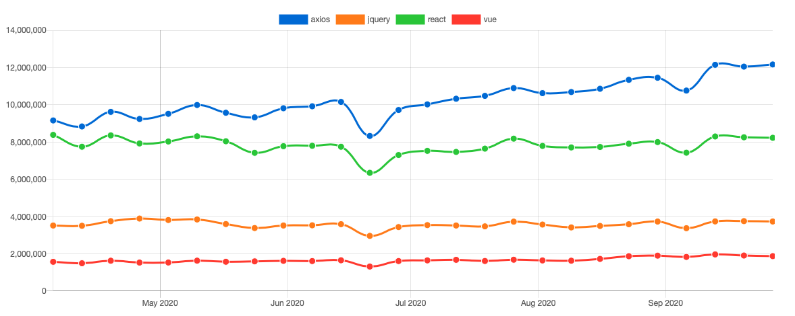

# 최은창


# 25. 03. 05

### 디지털 지갑
디지털 지갑은 암호화폐, 디지털 신원 정보, 인증서 등을 저장하고 관리하는 소프트웨어 또는 하드웨어를 의미한다.

**주요 특징**
* 암호화폐(예: 비트코인, 이더리움 등) 저장 및 거래 가능
* 개인 키(Private Key)를 안전하게 저장하여 신원 증명 및 서명 기능 수행
* DID 같은 디지털 신원 정보(Digital Credentials)도 저장할 수 있음
* 스마트폰 앱(MetaMask, Trust Wallet)또는 하드웨어(Ledger, Trezor) 형태로 제공됨

**디지털 지갑의 역할**
* 암호화폐 거래 및 관리
* DID 및 증명서(VC, Verifiable Credential)저장 및 제어
* 블록체인 기반 로그인 및 인증(비밀번호 없이 로그인 가능)


### DID (Decentralized Identifier, 분산 신원)
DID는 탈중앙화된 디지털 신원을 위한 고유한 식별자로, 중앙기관 없이 개인이 직접 신원 정보를 관리할 수 있도록 설계됨.

**주요 특징**
* 블록체인 기반의 고유한 식별자(예 did:example:1218671)
* 정부나 기업이 아닌 사용자가 직접 신원 정보 관리 가능
* 신뢰할 수 있는 기관이 제공하는 증명서(VC)를 이용하여 신원 증명 가능
* 디지털 지갑에서 DID를 저장하고 활용할 수 있음

** DID의 역할
* 신원 증명 (예: 디지털 운전 면허증, 졸업 증명서)
* 자기주권 신원(Self-Sovereign Identity, SSI) 지원 -> 사용자가 자신의 신원을 직접 관리
* 비밀번호 없는 로그인(예: 블록체인 기반 서비스에서 DID 로그인)


**정리하자면..**

|**비교 항목**|**디지털 지갑**|**DID(분산신원)**|
|---|---|---|
|개념|디지털 자산(암호화폐, 인증서 등) 저장 및 관리 도구|블록 체인 기반의 고유한 신원 식별자|
|역할|암호화폐 거래, DID 및 증명서 저장, 전자 서명|신원 증명, 자기주권 신원, 비밀번호 없는 인증|
|저장 방식|소프트웨어/하드웨어 형태의 지갑 앱|블록체인에 저장된 고유 식별자자|

1. 디지털 지갑이 DID를 저장하고 관리할 수 있음
2. DID를 이용한 신원 증명 과정에서 디지털 지갑이 사용자 서명 및 검증 역할을 수행
3. DID와 함께 검증 가능한 증명서(VC)가 함께 활용됨


DID는 신원을 식별하는 고유한 ID이며, 디지털 지갑은 그 ID 및 관련 데이터를 저장하고 사용하는 도구라고 이해하면 됨됨


# 25. 03. 06

### DID(Decentralized Identifier, 분산 신원)
DID는 **중앙 기관 없이 개인이 직접 자신의 신원을 증명할 수 있도록 만들어진 고유한 식별자(ID)**다.

**DID의 특징**
* 중앙기관(예: 정부, 은행)없이 사용자가 직접 신원을 관리
* W3C 표준에 따라 블록체인과 상관없이 DID 생성 가능
* DID를 통해 신원 증명서(VC)를 발급, 검증 가능

**DID는 신원을 나타내는 ID일 뿐, 직접 블록체인에 저장되는 것은 아님**
* DID 자체는 블록체인에 저장되지 않을 수도 잇음(DID는 반드시 블록체인을 필요로 하지 않음)
* 다만, DID를 발급하고 검증할 때 블록체인을 사용할 수 있음

### 블록체인 정보

블록체인은 **중앙 서버 없이 정보를 안전하게 저장하고 검증하는 분산 원장 기술** 이다.

**블록체인의 특징**
* 데이터를 조작할 수 없도록 암호화된 분산 저장 방식
* 거래 기록, 스마트 계약. DID 관련 메타데이터 등을 저장는 기능

* 블록체인은 DID 외에도 다양한 정보를 저장할 수 있음
* 암호화폐 거래 내역
* 스마트 계약
* 분산 애플리케이션(DApp) 관련 데이터
* DID의 공개 키, 신원 발급 기관 정보 등

# 25. 03. 07

### 중앙화 vs 탈중앙화 속도 차이

* 중앙화 시스템 (visa 등) : 1초당 약 2000건 처리 가능, 사용 가능까지 약 3분 소요
* 탈중앙화 시스템(블록체인) : 1초당 약 20건 처리 가능, 평균 10번의 인증(블록 생성)이 필요하여 처리 속도가 느림


### Solidify 개요
* Solidify는 스마트 컨트랙트를 작성하기 위한 언어
* **EVM**을 타겟으로 설계
* 정적타입 언어이며, 상속, 라이브러리, 사용자 데이터 타입 지원
* 스마트 컨트랙트 특징
  * 블로겣인에 업로드 되면 수정 불가, 누구나 확인 가능 -> 신뢰성 높음
  * 코드 작성 시 신중함 필요
* Remix IDE
  * 웹 기반 Solidity 개발 환경
  * 스마트 컨트랙트를 작성하고 실행 테스트 가능

### Solidity 문법 및 개념
#### 스마트 컨트랙트 구조
* 클래스와 유사한 개념으로 구성
  * 상태 변수
  * 함수 및함수 변경자(Modifier)
  * 이밴트(Event)
  * 구조체 (Struct), 열거형(Enum)
  * 상속 및 다형성 지원

#### 데이터 타입
* 문자열: `string`, `byte12` (UTF-8)지원
* 맵핑(Mapping) : `key-value`쌍으로 데이터를 저장(`adress` -> `string` 매핑 예제)
* 배열
  * 정적 배열 : 크기 고정
  * 동적 배열 : 블록체인상에서 지속적으로 추가 가능 -> 데이터베이스처럼 활용 가능
* 인터페이스 (Interface) 추상 계층 설계 가능

#### Modifier(한정자)
* 함수실행 조건을 정의

#### 데이터 저장 위치
* storage : 블록체인에 영구 저장(전역변수)
* memory : 휘발성 메모리(로컬변수)

#### 제어문
* `if`, `else`, `while`, `for`, `break`, `continue`, `return`, 삼항연산자(`? :`) 지원

#### 가시성(Visibility)

|접근제한자|설명|
|---|---|
|`public`|내부 및 외부에서 접근 가능 (자동 Getter 생성)|
|`external`|트랜잭션 또는 다른 컨트랙트에서만 호출 가능(this.f() 필요)|
|`internal`|내부 컨트랙트 및 상속된 컨트랙트에서만 접근 가능|
|`private`|내부 컨트랙트에서만 접근 가능 (상속된 컨트랙트에서도 접근 불가)|

#### 가스(Gas) 개념
* **EVM에서 실행되는 모든 작업에는 수수료(Gas) 필요**
* **가스 = 가스 가격(Gas Price) x 가스 사용량(Gas Used)**
* **가스 리밋(Gas Limit)**
  * 트랜잭션에 사용할 최대 가스 설정
  * 너무 낮게 설정하면 실행 도중 종료되며 사용한 가스는 반환되지 않음
* **가스 프라이스(Gas Price)**
  * 단위 가스당 가격
  * 가격이 높을수록 우선적으로 채굴됨

# 25. 03. 10
## Refresh Token을 사용하는 이유

> **잠깐! Redis는 무엇인가?**
> 레디스는 **인메모리 방식**의 데이터베이스다.


### 베이직 DB와 In-Memory DB 차이
* 기존 DB(mysql, postgreSQL)
	* 보조기억장치(HDD,SDD)에 데이터를 저장한다. 그래서 많은 양의 데이터를 오래 저장하는데 적절하다.
* 인메모리 DB(Redis, MemCache)
	* 주기억장치에 데이터를 저장한다. 그렇기 때문에 조회 성능이 월등히 빠르다.

**단!,** 주기억 장치를 이용하기 때문에 RAM의 휘발성 메모리의 특징도 가지고 있다. 그래서 중요한 데이터의 삭제를 예방하기 위해 fork 기능을 사용하여 보조기억장치에 저장하기도 한다.

> **Radis의 특징 3가지**
> 1. Key-Value 구조
> 2. 데이터 만료시간 설정 가능
> 3. 수평적 확자에 용이

위 특징 때문에 자주 조회되는 값인 Refresh Token을 Redis에 사용하자 라는 말이 많다. 하지만 해당 방식은 아무런 의미가 없다??


## 왜 Refresh Token을 사용할까?

* 완벽한 보안은 존재하지 않다.
* 세션 베이스(statefull) 인증과 '토큰'은 상호 대체적이지 안다.
	* 세션 베이스 인증에서도 토큰을 사용한다.

### 엑세스 토큰의 한계점
*  **잦은 로그아웃**
	* 엑세스 토큰을 단독으로 사용하면 **재발급 시 로그인**을 해야한다.
		* 때문에 만료시간을 짧게 하면 재로그인을 자주 해야하며, 만료시간을 길게하면 아래와 같은 보안 문제가 발생한다.
*  **보안 문제**
	* Access Token의 만료 시간을 길게하면 탈취 당했을 때 유저의 모든 권한을 탈취자가 가지게 된다.
	* 토큰은 statle-less 구조로 state의 주도권을 서버가 가지고 있지 않다.
	* 때문에 탈취 당했다고 하더라도 토큰 자체를 파기할 수 없다.
		* (이는 비용적으로는 장점이지만, 보안적으로는 단점이다.)

### Refresh Token이란?
Refresh Token은 Access Token의 문제점을 방지하기 위해 생겨났다.

* **잦은 로그아웃**
	* Refresh Token을 사용하여 Access Token을 갱신하여 재로그인 주기를 늘릴 수 있다.
* **보안 문제**
	* Access Token의 만료시간을 짧게 함으로써 탈취 시 문제를 조금이나마 방지할 수 있다.


# Refresh Token 탈취 시
* Refresh Token의 한계다. 서버 측에서의 대응이 불가능하다.
	* 이를 예방하기 위해 여러가지 Refresh Token 전략이 존재한다.
	* **상호 대체적인 전략도 존재하며, 상호 보완적 전략도 존재한다.**

## RTR(Refresh Token Roataion)전략
RTR은 Refresh API 사용 시, Acces Token과 함께 Refresh Token을 갱신시켜버리는 방식이다. RTR의 핵심은 **Refresh Token을 1회용으로 구현**하는 것이다.

구현 방식으로는 DB에 저장, rotation_tpye 옵션 사용, Refresh Token의 짧은 만료시간 등이 있다.

대신 XSS 취약점을 사용한 공격은 막지 못한다.

## Refresh Token에 http-only 적용 전략
Access Token은 Http Authorization header에 담아야하기 때문에 노출되는 것을 막을 수 없다. 하지만 리프레시 토큰을 사용할 때는 `http only`옵션을 사용하여 쿠키로 보낸다. JS에선는 Refresh Token에 접근할 수 없기 때문에 위 XSS공격을 예방할 수 있다.

**다만, 이 방법 또한 csrf(Cross-site request forgery)을 사용하면 탈취할 수 있다.**


## Access Token 만료시간 단축 전략
위에서 설명했던 부분이지만, 엑세스 토큰의 만료 시간을 짧게 설정하여 탈취 시 문제를 조금이나마 방지할 수 있다.
* 재발급이 횟수가 늘어나겠지만, **탈취 리스크를 줄이기 위해 권장**하는 방식이다.

## 사용자 정보를 Access Token에 저장 전략
발급 당시 IP, 기기/브라우저 정보 등을 저장하고 엑세스  토큰을 사용하는 자의 정보와 크게 다르다면 재로그인을 수행하는 전략이다. 이 또또한 권장한다.

## Token DB 저장 전략
Access/Refresh Token을 계정에 엑세스 토큰이 1:1로 매핑되도록 DB에 저장하는 방식이다. 
Refresh API를 수행할 때 이미 발급된 Access Token이 탈취 되었을 때 인증서버에서 거부할 수 있다.
이렇게 하면 State-less 구조의 장점을 잃어버린다. 이 방식으로 사용 할 바에는 세션을 사용하는게 맞다 **(Redis를 사용하는 이유에는 보안적인 이유는 없다.)**

## Refresh Token의 한계점
Refresh Token은 한계점이 명확하다. 보안적 역할을 하지 못한다는 평가도 존재한다.
+ 탈취된 Access Token을 만료시킬 수 없다.
+ Refresh Token이 탈취 된다면 결국 아무것도 할 수 없다.


## 이렇게 사용한다(기타 의견)
브라우저 환경인 웹 서비스는 Session을 사용하여 보안성을 가져가고
모바일 환경에서는 상대적으로 해킹이 어렵기 때문에 Token 방식을 사용한다.


# 25. 03. 11

## 순위에 RDB를 사용하지 않는 이유

## 실시간 성능 문제
랭킹 시스템은 보통 실시간으로 데이터를 업데이트 하고 빠르게 조회해야 한다. `RDB`는 데이터 일관성을 유지하기 위해 트랜잭션 관리와 락(lock) 메커니즘을 사용하기 때문에 대량의 쓰기/ 읽기 작업이 반복되는 경우 성능이 저하될 수 있다.

* 랭킹 업데이트 : RDB에서 순위를 계산하려면 매번 정렬 및 순위 계산을 해야할 수 있다. 이는 많은 데이터를 처리해야 하는 경우 매우 느려질 수 있다.
* 실시간 요구사항 : 사용자 수가 많고 랭킹이 자주 변동되는 경우, RDB는 높은 TPS(Transaction Per Second)를 처리하기 어렵다.

## 확장성 문제
`RDB`는 수평 확장이 어려운 경우가 많다. 반면, 랭킹 시스템은 사용자 수가 급격히 증가하거나 데이터 볼륨이 클 경우 수평 확장이 용이한 구조가 필요하다.
* `RDB`는 테이블의 스케일아웃(수평 확장) 보다는 스케일업(하드웨어 성능 강화)에 의존하는 경향이 있어 확장성이 떨어질 수 있다.
* 랭킹 시스템은 대규모 트래픽을 처리해야 하므로 `NoSQL`같은 분산 데이터베이스나 메모리 기반 데이터 저장소(Redis 등)를 사용하는 것이 더 적합할 수 있다.

## 일관성(CAP 이론)의 트레이드오프
랭킹 시스템은 엄격한 데이터 일관성보다 가용성과 성능이 더 중요할 때가 많다. RDB는 [[ACID]] 특성을 제공하지만 이는 성능에 영향을 미칠 수 있다.
* 랭킹 데이터는 실시간으로 자주 변경되고, 일관성 문제가 허용되는 경우가 많다.
* NoSQL이나 Redis를 사용하면 약간의 일관성을 희생하더라도 더 바른 처리 속도를 얻을 수 있다

## Redis와 같은 데이터 저장소의 적합성
랭킹 시스템에서는 보통 Redis와 같은 메모리 기반 데이터 저장소가 많이 사용된다. 이는 랭킹 데이터를 효율적으로 처리하기 위한 적합한 도구를 제공한다.
* `Sorted Set` : Redis의 Sorted Set은 행킹 데이터를 저장하고, 정렬된 상태로 유지하며, 특정 범위의 데이터를 빠르게 조회할 수 있도록 설계되었다.
* `TTL` : 랭킹 시스템에서 데이터의 유효기간을 설정할 수 있어 오래된 데이터를 자동으로 제거할 수 있다.
* `빠른 조회와 업데이트` : 메모리 기반으로 동작하기 떄문에 데이터 조회와 업데이트 속도가 매우 빠르다.

## 비관계형 데이터 모델의 유연성
랭킹 시스템은 보통 단순한 데이터 모델(사용자 ID,  점수 등)을 사용한다. 이런 데이터는 관계형 모델보다는 키-값 또는 정렬된 집합 데이터 모델에서 더 효과적으로 처리할 수 있다.


## 결론
`RDB`는 일반적인 CRUD 작업에는 적합하지만, 랭킹 시스템처럼 대량의 실시간 데이터를 고속으로 처리해야 하는 경우에는 Redis, MongoDB 같은 대체 기술이 더 적합한 경우가 많다. 특히, `Redis`의 **Sorted Set**을 활용하면 성능과 확장성을 동시에 확보할 수 있어 랭킹 시스템에 적합하다.

# 25. 03. 12

## ORM(Object-Relational Mapping)

* JPA에 대해서 알기전에 기본이 되는 **ORM에 대해서 알아야** 된다.
* ORM : 객체는 객체대로 설계하고, RDB(관계형 데이터베이스)는 RDB 대로 설계한다.
* 프레임워크로 객체와 RDB를 중간에서 서로 매핑해주는 역할을 담당한다.
* 대중적인 언어에는 대부분 ORM 기술이 존재한다.

### 1-1 ORM vs SQL Mapper(Mybatis, Spring jdbcTemplate)
* ORM
  * DB 테이블을 Java 객체로 Mapping(매핑) 함으로써 객체 간의 관계를 바탕으로 SQL문을 자동으로 생성(객체를 통해 간접적으로 DB 데이터를 조작)
  * DB 데이터 <- Mapping -> Object 필드
  * SQL 쿼리가 아니라 메서드로 데이터를 조작
  * 객체간 관계를 바탕으로 SQL을 자동으로 생성

* SQL Mapper
  * SQL을 직접 명시(SQL 문으로 직접 디비를 조작)
  * SQL <- Mapping -> Object 필드

* ORM은 RDB의 관계를 Object에 반영하는 것이 목적이라면, SQL Mapper는 단순히 필드를 매핑시키는 것이 목적이라는 차이점이 있다.

### JPA(Java-Persistence API)란?
* java 진영에서의 ORM 기술 표준으로, Java Application에서 RDB를 사용하는 방식을 정의한 인터페이스의 모음이다.
* 즉 실제로 동작하는 것이 아닌 인터페이스를 구현하여 사용한다.(대표적으로 Hibernate)
* JPA 2.1 표준 명세를 구현한 3가지 구현체
  * Hibernate
  * EclipseLink
  * DataNucleus
* SQL 작성없이 객체를 데이터베이스에 직접 저장할 수 있게 도와주는 기술로 Application과 JDBC사이에서 동작한다.

### SQL을 직접 다룰 때의 문제접(ex: MyBatis)
1. 반복적인 코드의 작성
	* 모든 DB 작업에 대한 SQL 문을 작성해야 한다.
	* 반복적인 CRUD SQL 작성과 객체 SQL에 매핑하는 코드를 작성하는데 시간이 오래 걸린다.
2. SQL 의존적 개발
	* 테이블에 Column이 추가된다면 모든 DAO의 SQL문 변경이 필요하다.
	* 만약 동작하지 않으면 Java에서의 로직과 SQL문 둘 다 확인이 필요하다.
3. 패러다임의 불일치
	 * Java는 객체지향 언어이지만, RDB(관계형 데이터베이스)는 객체지향이 다루는 개념이 존재하지 않고 서로 지향하는 목적이 다르기 때문에 패러다임의 불일치가 발생한다.
	 * 이러한 서로 다른 목적 떄문에 개발자가 중간에서 문제를 해결하기 위해 직접 코드를 작성해서 매핑해야 한다.

### JPA 장단점

**장점**

1. 생산성
	* JPA에 객체를 전달만 하면 되므로 SQL을 작성하고 JDBC API를 사용하는 반복적인 일을 JPA가 대신 처리해주어 생산성이 향상된다.
	* DDL도 JPA가 자동으로 생성해주기 때문에 DB 설계 중심으로 변경할 수 있다.
2. 유지 보수
	* SQL을 직접 다룰 때는 필드를 하나를 추가/삭제하여도 관련된 SQL과 JDBC코드를 전부 수정해야 했지만, JPA는 이를 대신 처리해주어 유지보수가 줄어든다.
3.  패러다임의 불일치 해결
	* JPA는 연관된 갹체를 사용하는 시점에서 SQL을 전달할 수 있고, 같은 트랜잭션 내에서 조회할 때 동일성도 보장하기 때문에 다양한 패러당미의 불일치를 해결한다.
4. 성능
	* 어플리케이션과 데이터베이스 사이에서 성능 최적화 기능을 제공한다.
	* 같은 트랜잭션 안에서는 같은 엔티티를 반환하기 때문에 통신 횟수를 줄일 수 있다.
5. 데이터 접근 추상화와 벤더 독립성
	* RDB는 같은 기능이라도 벤더마다 사용법이 다르기 때문에 처음 선택한 DB에 종속되고 변경이 어렵다.
	* JPA는 어플리케이션과 데이터베이스 사이에서 추상화된 데이터 접근을 제공하여 종속되지 않도록 도와준다.


**단점**

1. 학습 곡선이 높다.
	* JPA를 사용하려면 객체와 관계형 데이터베이스를 어떻게 매핑해야 하는지 학습한 후에 JPA의 핵심 개념들을 이해해야 한다.
	* JPA의 핵심 개념인 영속성 컨택스트에 대한 이해가 부족하면 SQL을 직접 사용해서 개발하는것보다 못한 상황이 발생할 수 있다.
2. 속도 저하 가능성이 있다.
	* 프로젝트의 규모가 크고 복잡하여 설계가 잘못된 경우, 속도 저하 및 일관성을 무너뜨릴 수 있다.
	* 복잡하고 무거운 Query는 속도를 위해 별도의 튜닝이 필요하기 때문에 결국 SQL문을 써야 할 수 있다.

### 동작 과정

 * JPA는 어플리케이션과 JDBC API 사이에서 동작한다.
 * 개발자가 JPA를 사용하면, JPA 내부에서는 JDBC API를 사용하여 SQL을 생성하고 DB와 통신한다.
	* JPA에서의 CRUD
```sql
jpaEm.persist(member);// 저장
jpaEm.fid(memberId);  //조회
jpaEm.remove(member); //삭제

// 수정(조회 이후 해당 객체에 변경하면 DB에도 변경된다.)
// 영속성 컨텍스트

Member.member = jpaEm.find(memberId);
member.setName("변경할 이름);
```

* JPA에서는 수정 매소드를 제공하지 않는다.
* 하지만 수정은 필요한 동작이기 때문에 JPA에서는 데이터 수정 시, 매핑된 객체(테이블 데이터)를 조회해서 값을 변경 후 커밋하면 DB 서버에서 UPDATE문으로 바꾸어 UPDATE를 실행한다.

#### 5-1. 저장(persist = insert)


* Member 를 저장할 때, JPA는 아래와 같이 동작한다.
	1. Member객체를 JPA에 넘긴다.
	2. JPA는 객체의 엔티티(Entity)를 분석한다.
	3. JPA에서 INSERT 쿼리(SQL)를 생성한다.
	4. JPA가 JDBC API를 사용하여 생성한 SQL를 DB에 요청한다.
#### 5-2. 조회(find = select)

* Member를 조회할 때, JPA는 아래와 같이 동작한다.
	1. Member 객체 필드에서 PK(Primary Key)값을 JPA에 넘긴다.
	2. JPA에서 Member 엔티티(Entity)의 매핑 정보를 바탕으로 쿼리를 생성한다.
	3. JPA가 JDBC API를 사용하여 생성한 SQL를 DB에 요청한다.
	4. JPA가 JDBC API를 통해 DB로 부터 결과를 받아온다.
	5. JPA는 결과(ResultSet)를 객체(Member)의 Entity에 맞게 모두 매핑한다.
* 쿼리를 JPA가 만들어 주기 때문에 Object와 RDB 간의 패러다임 불일치를 해결 할 수 있다.

### 6. JPA 어노테이션 종류
* JPA는 어노테이션을 분석하여 어떤 객체가 어떤 테이블과 관계가 있는지를 알아낸다.

|어노테이션|설명|
|---|---|
|@Entity|데이터베이스의 테이블과 일대일로 매칭되는 객체 단위이며, 클래스를 테이블과 매핑한다고 JPA에게 알린다.|
|@Table|@Entity 선언된 클래스에 매핑할 테이블정보(테이블 이름)을 알려준다.이 어노테이션이 생략되면 클래스 이름을 테이블 이름으로 매핑한다.|
|@cloumn|데이터베이스의 테이블에 있는 컬럼에 필드(변수)를 매핑한다. 별다른 옵션을 설정하지 않는다면 기본적으로는 생략이 가능하다.|
|@id|@Entity 선언된 클래스의 필드를 테이블의 기본키(Primary Key)에 매핑한다.|
|@GeneratedValue|새로운 레코드가 생성될 때마다 마지막 PK 값에서 자동으로 +1 을 해줘야 하는 auto Increment 컬럼인 것을 알려준다.
|@Embeddedid|복합키로서 정의된 값을 정의하고자 할 때 사용한다.|
|@Enumerated|Java의 Enum 형태로 되어 있는 미리 정의되어 있는 코드 값이나 구분 값을 데이터 타입으로 사용할 때 사용한다.|
|@Transient|Entity 객체 에 속성으로 지정되어 있지만, 데이터베이스에서는 필요 없는 속성일 때 사용한다.|

# 25. 03. 13

리엑트는 효율적인 UI 구현을 위한 라이브러리다. `HTTP client(HTTP 상에서 커뮤니케이션을 하는 자바 기반 컴포넌트)`를 내장하고 있는 Angular와는 다르게, 리액트는 따로 내장 클래스가 존재하지 않는다.

따라서 리엑트에서 Ajax를 구현하려면 JavaCript 내장객체인 XMLRequest를 사용하거나, 다른 HTTP Client를 사용해야 한다.

> 짚고 넣어가기
>
> **💡AJAX(Asnchronous Javascript And XML)**
>
> Javasciprt의 라이브러리 중 하나이며, Asynchronous javascript And Xml(비동기식 자바스크립트와 xml)의 약자다. 브라우저가 가지고 있는 XMLHttpRequest 객체를 이용해서 **전체 페이지를 새로 고치지 않고도 페이지 일부만**을 위한 데이터를 로드하는 기법이며, JavaScript를 사용한 비동기 통신, 클라이언트와 서버간에 XML 데이터를 주고받는 기술이다. 정리하자면, 자바스크립트를 통해서 서버에 데이터를 요청하는 것이다.
>
> **💡비동기 방식이란?**
>
> 비동기 방식은 웹페이지르르 리로드하지 않고 데이터를 불러오는 방식이며, Ajax를 통해서 서버에 요청을 한 후 멈춰 있는 것이 아니라 그 프로그램은 계속 돌아간다는 의미를 내포하고 있다.
>
> 
>
> **비동기 방식의 장점**
>
> 페이지 리로드의 경우 전체 리소스를 다시 불러와야하는데 이미지, 스크립트, 기타 코드등을 모두 재요청할 경우 불필요한 리소스 낭비가 발생하게 되지만 비동기식 방식을 이용할 경우 필요한 부분만 불러와 사용할 수 있으므로 매우 큰 장점이 있다.

## Axios vs Fetch API

우리는 일반적으로 자바스크립트에서 API를 연동하기 위해서 보통 `Fetch API`를 사용하곤 했다. 리액트도 자바 스크립트 built-in 라이브러리 중 하나인 Fetch API 라는 훌륭한 API 연동 모듈을 사용한다. 하지만 Fetch API는 자바 스크립트의 Built-in 라이브러리라는 특성 때문인지 많은 사람들이 리엑트에 axios를 사용하는 것을 선호한다.


## 🤔그렇다면 많은 사람들이 왜 Fetch API말고 Axios를 더 선호할까?

### Fetch API
```javascript
const url = 'http://localhost3000/test'
const option = {
	method: 'POST',
	header: {
		'Accept' : 'application/json',
		'content-Type' : 'application/json'; charset=UTP-8'
	},
	body: JSON.stringify({
		name: 'sewon',
		age:20
	})

	fetch(url,options).then(response => console.log(response))
}
```

### axios
```javascript
const option = {
	url = 'http://localhost3000/test'
	method:'POST'
	header:{
		'Accept' : 'application/json',
		'Content-Type' : 'application/json'; 'charset=UTP-8'
	},
	data: {
		name : 'sewon'
		age:20
	}
	axios(options).then(response => console.log(response))
}
```

## Axios
axios는 브라우저, Node.js를 위한 Promise API를 활용하는 HTTP 비동기 통신 라이브러리다. (백엔드와 프론트엔드와 통신을 쉽게하기 위해 AJAX도 더불어 사용하기도 한다.)

## Axios 특징
* 운영 환경에 따라 브라우저의 XMLHttpRequest 객체 또는 Node.js의 HTTP API 사용
* Promise(ES6) API 사용
* 요청과 응답 데이터의 변형
* HTTP 요청 취소 및 요청과 응답을 JSON 형태로 자동 변경

# 25. 03. 14

## React.FC

`Function Component` 타입의 줄임말로, React+Typescript 조합으로 개발할 때 사용하는 타입이다. 함**수형 컴포넌트 사용 시 타입 선언**에 쓸 수 있도록 React에서 제공하는 타입이다.

## React.FC 사용
타입스크립트를 이용해서 리액트로 작업을 하다보면 아래의 형태로 작업을 하는 경우가 많다.
```javascript
import React from 'react';
type GreetingsProps = {
	name: string;
};
const Greetings: React.FC<greetingsProps> = {{ name }} => (
	<div>Hello, {name} </div>
);
export default Greetings;
```
React.FC 를 사용하는 경우에는 다음과 같이 `props`의 타입을 `Generics`으로 넣어서 사용한다.
하지만 이렇게 React.FC로 타입을 지정하는 것은 지양하라는 개발자들도 있어서 그 이유를 알아보자

## React.FC 사용을 지양해야 하는 이유

지금은 좀 지난 문서이긴 하지만 CRA에서는 기본 템플릿에 FC를 빼야한다는 PR이 올라왔었고, 실제 반영되었다. 아래에 작성 내용들은 위 PR에서 주장한 내용들과 검색을 통한 자료들을 참고 하여 작성하였다.

### 1. children
`React.FC`를 사용하면 `props`에 기본적으로 `children`이 들어가 있다는 것이다.

```java
// React.FC 사용
export const Greeting: React.FC<GreetingProps> = ({ name }) => {
return <h1>Hello {name}</h1>
}

const App = () => (
	<>
		<Greeting name = "Stefan">
			<span>{" I can set this element but it doesn't do anything"}</span> 
		// children 전달
		</Greeting>
	</>
)
```

이점을 장점이라고 생각할 수도 있는 부분이지만, 하지만 타입스크립트를 쓰는 이유중 하나가 정확한 타입을 지정해주면서 자바스크립트 코드의 안정성을 향상 시키는 부분인데 `FC`를 사용하면 컴포넌트에 `children`이 있을 수 있다는 것을 가정하여 언제든지 `children`의 타입 지정 없이 전달이 가능하기 때문에 타입이 명확하지 않다는 단점이 있다.

### 2. defaultProps
`defaultProps`는 props에 기본값을 세팅할 수 있도록 도와주는데, `React.FC`를 사용할 시에는 `defaultProps`인식에 대한 이슈가 있었다.

```javascript
type GreetingsProps = {
	name: string;
	mark: string;
};

const Greetings: React.FC<GreetingsProps> = ({ name, mark}) => (
	<div>
		Hello, {name} {mark}
	</div>	
);

Greetings.defaultProps = {
	mark: '!' // 유효하지 않음.
};

export default Greetings;
```

### 3. 코드 길이가 더 길다.
중요한 부분까지는 아니지만 담음과 깉이 `React.FC`를 사용하면 코드가 더 길다는 이유도 있다.
```javascript
const C1: React.FC<CProps> = (props) => { }
const C2: (propss : Cprops) => {};
```

## 결론
`React.FC`를 사용하지 않고 **props타입을 직접 지정해주는 것이 더욱 타입스크립트** 같고, 다양한 경우에서 안전하다고 생각한다.


# # 25. 03. 17
## TroubleShooting 가이드

### TroubleShooting이란?
문제가 발생했을 때 그 원인을 규명하고 문제를 복구하는 일련의 작업을 의미, 개발 중에 발생할 수 있는 다양한 문제와 그 해결 방법을 체계적으로 정리한 것이 TroubleShooting 가이드다. 이러한 가이드는 내부 및 외부 개발자 모두에게 유용한 자료가 된다.
 * 내부 개발자에게는 반복적인 문제 해결과 리소스 관리에 큰 도움이 된다.
 * 외부 개발자 입장에서도 쉽게 해결책을 찾아 빠르게 문제를 해결 할 수 있게 도와준다.
따라서 TroubleShooting 가이드는 문제를 신속히 해결할 수 있도록 돕는 필수적인 문서다.

### TroubleShooting 가이드의 중요성
특정 문제에 대해 여러 번 동일한 답변을 반복하거나, 같은 내용의 문서를 여러 개발자가 각각 작성하는 경우가 발생할 수 있다. 이러한 반복 잡업은 개발자들의 본래 일정에 차질을 줄 뿐만 아니라, 효율적인 리소스 관리에도 부담을 준다. 

만약 오류 상황과 해결 방법을 한데 모아 정리해둔 문서가 있다면 CS 처리에 필요한 리소스를 크게 줄일 수 있다.

-> 이러한 필요성에서 **TroubleShooting 가이드**의 중요성이 부각된다.

# 25. 03. 18
## TroubleShooting 가이드 작성 TIP

### 1. 정확한 원인을 파악하도록 도와라
아마 오류 상황을 마주한 개발자가 가장 궁굼한 것은 해당 오류가 왜 발생했는지 그 원인일 것이다. 실제로 똑같은 증상임에도 상황과 환경에 따라 그 원인이 달라지기도 한다. 원인이 다르면 당연히 해결 방법도 달라지기 때문에 독자로 하여금 문제의 원인을 정확하게 파악하도록 돕는 것이 중요하다. 이를 위해 문제에 대한 다양한 상황을 제공하여 독자가 본인의 상황에 해당하는 부분을 따라가도록 유도한다. 또한 진단 테스트 방법 등을 안내하여 여러 가지 경우를 테스트하여 오류의 원인을 더 명확하게 파악하도록 할 수도 있다.

### 2. 다양한 케이스를 제공하라
개발 중 발생하는 오류는 정말 다양하다. 증상이 같지만, 원인이 다른 경우도 있고 같은 오류 메시지가 나타난 경우라도 서비스에 따라 그 해결 방법이 다르기도 하다. TroubleShooting 가이드에는 가능한 이런 경우들을 최대한 고려하여 문서화하는 것이 중요하다. 처음부터 모든 오류 케이스들을 제시하는 것이 어려울 수 잇지만, 오류 관련 CS가 들어올 때마다 지속적인 문서화와 업데이트를 통해 보다 풍부한 TroubleShooting 가이드를 작성할 수 있다.

### 3. 링크를 활용하라
TroubleShooting 가이드는 다른 가이드와는 달리 처음부터 끝가지 읽을 필요가 없다. 본인이 마주한 특정한 오류에 대한 정보를 빠르게 찾는 것이 중요하다.

가이드 내에 링크 연결을 활용하면 독자가 필요한 정보를 빠르게 찾을 수 있도록 도울 수 있다. 가이드 상단에 테이블 혹은 목차 형태로 링크 연결을 제공하면 원하는 부분으로 바로 이동할 수 있어 편리하다. 또한 어떤 작업을 다시 해야한다면, TroubleShooting 가이드에 모든 시퀀스를 적기 보다는 해당하는 문서로 이동하여 작업을 수행 할 수 있도록 링크 연결로 안나흐는 것이 역시 좋은 방법이다.

### 4. 잘 보이는 곳에 위치 시켜라

개발 중 오류가 발생했는데 'TroubleShooring 가이드가 어디 있지?'하고 기술문서 사이트를 이리저리 살펴본 경험이 있지 않은가? 일부 문서 사이트에서는 TroubleShooting 가이드가 잘 보이지 않는 곳에 있어서 독자들이 TroubleShooting 가이드를 신속히 찾을 수 없는 상황이 발생한다.시급히 오류 상황을 해결해야 하는 개발자 입장에서 이렇게 TroubleShooting 가이드가 안 보이는 곳에 숨어 잇다면 여간 불편하지 않을 수 없다. 따라서 TroubleShooting 가이드를 잘 보이는 곳에 위치시키고, 또한 본문 중간에 TroubleShooting 가이드에 대한 링크를 안내 메시지 등으로 제공하는 것도 하나의 팁이 될 수 있을 것이다.

# 25. 03. 19

## 트러블 슈팅 템플릿 및 트러블 슈팅 가이드 템플릿

## 제목 : [서비스명/기능명/문제명] 프로젝트- 번호
### 1. 문제 개요
* 오류 상황 : 문제 발생 상항과 영향 범위 (예: 특정 코드 실행 시 발생, 특정 라이브러리 버전 호환 문제 등)
* 발생 배경 : 문제를 접하게 된 상황 또는 초기 문제 발견 경위 (예: 코드 테스트 중, 배포 중 문제 발견 등)
### 2. 오류 코드 및 오류 메시지
* 오류 코드: 발생한 오류 코드 또는 HTTP 상태 코드(예: 404, 500 등)
* 오류 메시지: 화면이나 로그에 출력된 구체적인 오류 메시지 (에러 복사 가능하도록 작성)
* 관련 로그: 에러 로그를 분석하는 데 필요한 구체적인 로그 (예: 에러 발생 시점, 관련 라이브러리 호출 정보 등)
### 3. 원인 분석
* 오류 원인 : 문제 발생 원인에 대한 설명(예: Spring IoC Container의 작동 방식, Jupiter의 관리 주체 등)
	* 문제 해결 과정에서 이해한 추가적인 원인이나 근본적인 이유를 포함
* 에러 로그 해석: 로그 메시지를 통해 확인한 중요한 단서나 인사이트
* 구조적 이해: 문제 해결을 위해 필요한 프레임워크나 라이브러리의 구조적 이해를 간단히 설명
### 4. 해결책
 * 단계별 조치 방법: 문제 해결을 위한 구체적인 단계별 절차 안내
	 * Steop 1:  구체적인 조치 - 특정 에노테이션 추가, 라이브러리 버전 조정 등
	 * Steop 2  구체적인 조치 - 환경 재설정, 설정 파일 수정 등
	 * (필요 시 단계 추가)
*  코드 예시 : 문제 해ㅑ결에 필요한 코드 예시가 있다면 추가
```java
//예시 코드
@AuthWired Constructor
```
* 추가 자료: 에러 발생 원인이나 해결 과정에서참고한 자료 또는 문서 링크(예: 관련 공식 문서, 개발자 커뮤니티 게시물)

### 5. 교훈 및 주의사항
* 주의할 점: 유사한 문제를 방지하기 위해 주의할 점 (예: 에노테이션 명시 여부, 프레임 워크 업데이트 주기 확인 등)
* 배운 점 : 문제 해결 과정에서 배운점이나 중요한 교훈을 공유
# 25. 03. 20

## Troubleshooting Guide - Spring Bean 주입 문제

---

### 1. 문제 개요

- **오류 상황**: Spring 테스트 코드에서 Bean 주입 실패로 인해 테스트가 실패함
- **발생 배경**: 생성자 주입을 통해 Bean을 주입받으려 했으나, 테스트 코드에서 주입되지 않음

### 2. 오류 코드 및 오류 메시지

- **오류 코드**: FileNotFoundError
- **오류 메시지**: `No ParameterResolver found for parameter`
- **관련 로그**: 해당 오류 발생 시점의 로그와 Jupiter의 파라미터 처리 관련 로그

### 3. 원인 분석

- **오류 원인**: Spring IoC Container가 아닌 Jupiter가 테스트 클래스의 인스턴스를 관리하는 구조적 이유로, @Autowired 애노테이션을 명시하지 않으면 Bean 주입이 불가
- **에러 로그 해석**: ParameterResolver가 없어 Bean을 주입할 수 없다는 오류를 통해 Jupiter의 역할과 한계를 확인
- **구조적 이해**: JUnit 5 아키텍처에서 Jupiter가 어떻게 작동하는지와 Spring IoC Container가 아닌 Jupiter가 테스트 인스턴스를 관리하는 이유 설명

### 4. 해결책

- **Step 1**: 테스트 클래스의 생성자에 @Autowired 애노테이션 추가
    
    ```kotlin
    class MyTestClass @Autowired constructor(val myBean: MyBean) { ... }
    ```
    
- **Step 2**: 테스트 실행 후 Bean 주입이 정상적으로 이루어졌는지 확인
- **추가 자료**: [JUnit 5 구조 설명 링크](https://junit.org/junit5/docs/current/user-guide/), [Spring Framework 공식 문서](https://spring.io/projects/spring-framework)

### 5. 교훈 및 주의 사항

- **주의할 점**: 테스트 코드에서 IoC Container가 아닌 Jupiter가 관리 주체임을 명심하고, 필요시 애노테이션을 명시
- **배운 점**: 로그 해석의 중요성과 프레임워크 구조에 대한 이해 필요성

# 25. 03. 21

## 통합 Troubleshooting 가이드 문서 템플릿

---

## **문서 개요**

- **문서 목적**: 이 문서는 개발 중 발생할 수 있는 주요 문제 상황과 해결 방법을 체계적으로 정리한 통합 가이드이다다. 이를 통해 동일한 문제에 대한 반복적인 질문과 응답을 줄이고, 빠른 문제 해결을 지원하다.
- **대상 독자**: 내/외부 개발자, IT 지원 팀, 고객 서비스 담당자

---

## **목차**

1. [문제 상황 1: 문제 설명](https://www.notion.so/TroubleShooting-1318da87b708818fa2ede5d512866e28?pvs=21)
2. [문제 상황 2: 문제 설명](https://www.notion.so/TroubleShooting-1318da87b708818fa2ede5d512866e28?pvs=21)
3. [문제 상황 3: 문제 설명](https://www.notion.so/TroubleShooting-1318da87b708818fa2ede5d512866e28?pvs=21)
4. ...

---

## **Troubleshooting 가이드 개요**

### 문제 상황의 목록과 간략한 설명을 제공한다.

|**문제 상황**|**간략 설명**|**대상 기능/서비스**|**관련 코드**|
|---|---|---|---|
|문제 상황 1|문제 설명|기능/서비스 이름|관련 오류 코드|
|문제 상황 2|문제 설명|기능/서비스 이름|관련 오류 코드|
|문제 상황 3|문제 설명|기능/서비스 이름|관련 오류 코드|

---

## **문제 상황별 Troubleshooting 가이드**

### 문제 상황 1: [문제 제목]

### 1. 문제 개요

- **오류 상황**: 구체적인 발생 상황과 범위
- **발생 배경**: 문제를 접하게 된 경위나 초기 증상

### 2. 오류 코드 및 메시지

- **오류 코드**: 관련 오류 코드 또는 상태 코드 (예: 404, 500 등)
- **오류 메시지**: 발생 시 출력된 구체적인 메시지
- **관련 로그**: 로그 분석에 필요한 구체적인 정보

### 3. 원인 분석

- **오류 원인**: 문제 발생 원인과 구조적 이해
- **에러 로그 해석**: 로그에서 확인한 핵심 단서

### 4. 해결책

- **단계별 조치 방법**: 문제 해결을 위한 구체적인 절차
- **코드 예시**: 해결에 필요한 코드나 설정 예시
- **참고 자료**: 해결 과정에서 유용했던 추가 자료 링크

---

### 문제 상황 2: [문제 제목]

### 1. 문제 개요

- **오류 상황**: 발생 상황 및 범위
- **발생 배경**: 문제 발생 배경

### 2. 오류 코드 및 메시지

- **오류 코드**: 관련 오류 코드
- **오류 메시지**: 발생 시 출력된 메시지
- **관련 로그**: 로그 분석에 필요한 정보

### 3. 원인 분석

- **오류 원인**: 문제 발생 원인
- **에러 로그 해석**: 로그에서 확인한 단서

### 4. 해결책

- **단계별 조치 방법**: 단계별 해결 절차
- **코드 예시**: 코드 예시
- **참고 자료**: 추가 자료 링크

---

## **추가 정보**

### Troubleshooting 작성 시 주의 사항

- **일관성 유지**: 각 문제 상황의 템플릿 형식을 유지하여, 독자가 원하는 문제를 빠르게 찾아볼 수 있도록 구성하다.
- **업데이트 기록**: 문서가 최신 정보로 유지되도록 주기적으로 검토하고 수정 사항을 기록하다.
- **문서 위치 안내**: Troubleshooting 가이드의 위치를 기술문서나 내부 인트라넷에서 쉽게 찾을 수 있도록 안내하다.


